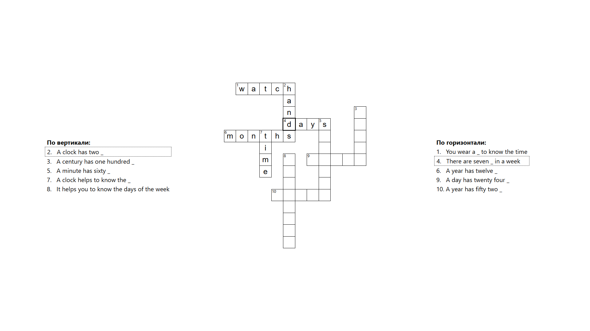

# Voice Crosswords

**Crossword webapp with voice assistant SberSalute created with TypeScript & React**

https://developers.sber.ru/link/hWAUaBy

---

## Features

- Render crossword from JSON file
- Select level via menu
- Navigation using keyboard or voice
- Letter-by-letter word input and deletion using keyboard
- Voice input and deletion of the whole word if possible
- Solution check with mistake highlighting
- Visual aids
- Sber design

## Controls

### Hotkeys:

|            Key             | Usage                |
|:--------------------------:|----------------------|
| `LBM` \| `Arrows` \| `Tab` | select level or cell |
|        `Backspace`         | backward delete      |
|          `Space`           | forward delete       |
|          `Enter`           | check solution       |
|           `Esc`            | back to menu         |

### Voice commands:

|                    Command                    | Usage          |
|:---------------------------------------------:|----------------|
|           `открой <номер> уровень`            | select level   |
| `<номер> по <вертикали\|горизонтали> <слово>` | enter word     |
|  `удали <номер> по <вертикали\|горизонтали>`  | delete word    |
|                   `проверь`                   | check solution |
|                `выбор уровня`                 | back to menu   |

## Demonstration

## Technologies

|                                          Tech                                          | Usage                                    |
|:--------------------------------------------------------------------------------------:|------------------------------------------|
|                     [TypeScript](https://www.typescriptlang.org/)                      | main                                     |
|                             [ReactJS](https://react.dev/)                              | main                                     |
|            [SaluteJS](https://developers.sber.ru/portal/products/salutejs)             | assistant for voice navigation and input |
| [PlasmaUI](https://developers.sber.ru/docs/ru/va/canvas/step-by-step/interface/plasma) | components for sber design               |

## Authors

|                                Name                                | Contribution |
|:------------------------------------------------------------------:|--------------|
|       [Sh1kar1 (Nikita Kablov)](https://github.com/Sh1kar1)        | frontend     |
| [lopatkinanton (Anton Lopatkin)](https://github.com/lopatkinanton) | backend      |
|       [mob1324 (Andrew Pinkas)](https://github.com/mob1324)        | parsing      |

## License

Distributed under the Unlicense license - see [LICENSE](./LICENSE) for more information

_This project was completed as part of studies at the University of Science and Technology MISIS in the Applied Mathematics program_
