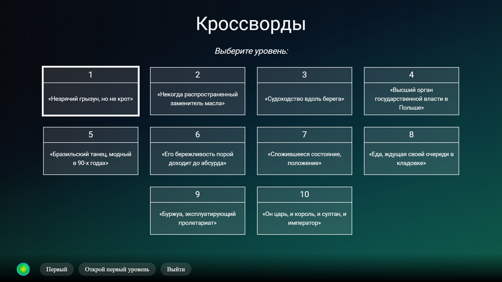
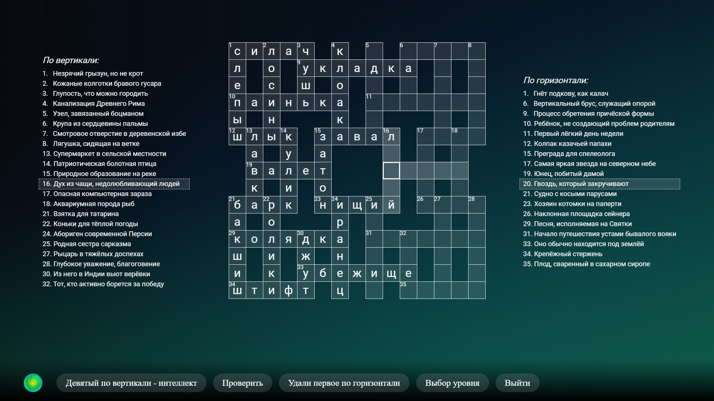

# Voice Crosswords

**Crossword webapp for Sber smart TVs with Salute voice assistant created using TypeScript & React**

https://developers.sber.ru/link/hWAUaBy

## Overview

### Technologies

- TypeScript & CSS & HTML
- SmartApp DSL
- [React](https://react.dev/) & [react-router-dom](https://reactrouter.com/en/main)
- [styled-components](https://styled-components.com/) & [PlasmaUI](https://developers.sber.ru/docs/ru/va/canvas/step-by-step/interface/plasma)
- [SaluteJS](https://developers.sber.ru/portal/products/salutejs)

### Features

- Render crossword from a JSON file
- Select level via menu
- Navigation using keyboard or voice
- Letter-by-letter word input and deletion using the keyboard
- Voice input and deletion of the whole word if possible
- Solution check with mistake highlighting
- Visual aids
- Adaptive layout
- Sber design

### Demonstration

## Usage

|            Key             | Usage                |
|:--------------------------:|----------------------|
| `LBM` \| `Arrows` \| `Tab` | select level or cell |
|        `Backspace`         | backward delete      |
|          `Space`           | forward delete       |
|          `Enter`           | check solution       |
|           `Esc`            | back to menu         |

|                    Command                    | Usage          |
|:---------------------------------------------:|----------------|
|           `открой <номер> уровень`            | select level   |
| `<номер> по <вертикали\|горизонтали> <слово>` | enter word     |
|  `удали <номер> по <вертикали\|горизонтали>`  | delete word    |
|                   `проверь`                   | check solution |
|                `выбор уровня`                 | back to menu   |

## Authors

|                      Author                       | Contribution |
|:-------------------------------------------------:|--------------|
|       [Sh1kar1](https://github.com/Sh1kar1)       | frontend     |
| [lopatkinanton](https://github.com/lopatkinanton) | backend      |
|       [mob1324](https://github.com/mob1324)       | parsing      |

## License

Distributed under the Unlicense license - see [LICENSE](./LICENSE) for more information

_This project was completed as part of studies at [NUST MISIS](https://en.misis.ru/) in the Applied Mathematics program_
